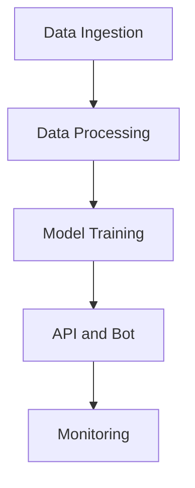

# MasterCoderAI Architecture

## Overview
MasterCoderAI is a modular and extensible project designed to handle the entire lifecycle of AI development, from data ingestion to deployment and monitoring. Below is an overview of its architecture:

### Key Components

1. **Data Pipeline**
   - **Ingestion**: Collects raw data from GitHub, Wikipedia, and other sources.
   - **Processing**: Cleans and prepares data for training.
   - **Validation**: Ensures data quality and consistency.

2. **AI Engine**
   - **Model Training**: Supports training of custom AI models.
   - **Hybrid Models**: Combines multiple AI approaches for better performance.
   - **Prompt Engineering**: Optimizes prompts for LLMs.

3. **API and Bot**
   - **FastAPI**: Provides REST and WebSocket endpoints for interaction.
   - **Bot Orchestration**: Manages bot responses and integrates with the AI engine.

4. **Infrastructure**
   - **Kubernetes**: Manages containerized deployments.
   - **Terraform**: Defines cloud infrastructure as code.

5. **Monitoring**
   - **Prometheus**: Collects metrics for performance monitoring.
   - **Grafana**: Visualizes metrics and logs.

### Data Flow Diagram

### Folder Structure

- **src/**: Contains all source code.
  - **ai_engine/**: AI model logic and utilities.
  - **api/**: FastAPI application.
  - **bot/**: Bot orchestration.
  - **tok_podataka/**: Data pipeline.
  - **graf_znanja/**: Knowledge graph.
- **podaci/**: Raw and processed data.
- **modeli/**: Trained models and checkpoints.
- **nadzor/**: Monitoring configurations.
- **infrastruktura/**: Infrastructure as code.

## Future Enhancements
- Modularize into separate repositories for better scalability.
- Add AutoGPT-like agents for iterative improvements.
- Integrate LangChain for modular LLM components.